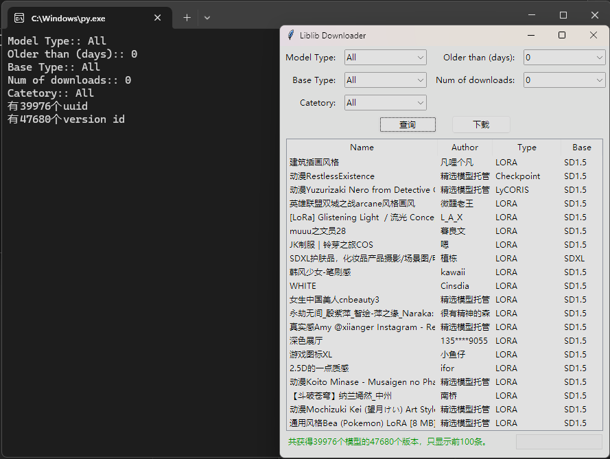

# LiblibDownload
传闻说哩布哩布即将关闭免费下载模型，那就赶紧写个脚本来下载吧。
用得上的话右上角给点个星星:D

# 文件介绍

#### get_all_models_info.py

负责从哩布的接口获取所有指定类别的模型信息，比如100033代表“建筑与空间设计”类别。如果不指定，就是无差别获取所有模型，目前是4万多个。
数据保存在名为models.db的sqlite数据库里，包含所有的模型必要信息，包括每个模型每个版本的下载链接和图片链接等。

#### download.py

负责根据get_all_models_info.py生成的数据库进行下载。用tkinter实现图形界面。下载过程如下：
1. 建立模型基础类型目录，如SDXL、SD1.5。
2. 根据模型类型（如Checkpoint/LORA）、模型名称、模型版本建立相应的子目录
3. 根据模型地址和封面图片地址，连同说明文字什么的，下载到相应的子目录中
4. 下载地址的文件名经常是无意义的，按照模型版本名称重命名

#### aria2c.exe

一个开源的下载程序，download.py会调用它下载那些巨大的文件，要放到跟download.py同一个目录里。
有条件的最好自己去github下载这个软件并解压放到同一个目录里，地址：
https://github.com/aria2/aria2/releases/download/release-1.37.0/aria2-1.37.0-win-32bit-build1.zip

# 用法

1. 没有python的话先安装python
2. 下载最新的download.py和models.db，直接从上面点击每个文件下载也行，从右边的Releases里下载也行，一样的，存到任意文件夹里里并打开文件夹。aria2c.exe也放到同一个文件夹里。
3. 双击或从命令行运行download.py即可，从图形化界面上过滤要下载的模型，点击下载。注意下载就是下载全部模型啊，下方绿字如果显示“共获得1000个模型的2000个版本”，那就是真下载全部2000个版本。

4. Sit back and relax.

# 备注

get_all_models_info.py已更新自动上传机制，你不用自己运行，它会每天在某个遥远的服务器上自动运行，自动更新数据库，自动上传到github里，代码库里的models.db就是最新的数据库文件，从commit comment里能看出更新日期。

### 群友反应MacOS不能下载，试了下确实如此，大约是异步调用的机制问题，但我没有Mac来调试，所以就是暂不支持了。Windows是没有问题。

### 如果你是打包下载了整个代码，你会发现里面的models.db大小不对，这是因为这个文件比较大，github存储它的方式不一样，默认不会打包到代码里。没事，单独点击[这个数据文件](https://github.com/lilei105/LiblibDownload/blob/master/models.db) 下载一下就好了，它现在是90多MB的样子。